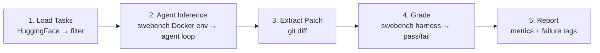

# SWE-bench Verified Eval Harness

Build a complete evaluation harness that loads SWE-bench Verified tasks, runs recall-agent on each task inside the correct Docker environment, collects the generated patches, and grades them using the official `swebench` harness.

## Resolved Questions

### 1. Data classes vs. Normal classes vs. Pydantic
Here is the tradeoff breakdown for why we are using Python `dataclasses`:
*   **Normal Classes**: High boilerplate. You have to write `def __init__(self, ...): self.a = a`, write a custom `__repr__` for logging, and write custom logic to convert the object to a dictionary for JSON saving.
*   **Pydantic**: Excellent for validating untrusted data at boundaries (e.g., the existing codebase uses it to validate LLM tool call arguments). However, it adds runtime overhead and is overkill for internal data passing where we already know the types.
*   **Dataclasses** (`@dataclass`): The Python standard library's "sweet spot" for internal structs. It automatically generates `__init__`, `__repr__`, and `__eq__`, eliminating boilerplate. It provides `dataclasses.asdict()` for free JSON serialization, with zero third-party dependencies.

### 2. What if the agent commits changes?
This is a great edge case. If the agent runs `git commit`, `HEAD` moves forward. Running standard `git diff` or `git diff HEAD` would miss the committed changes and result in an empty patch.
**The Fix**: SWE-bench provides the exact `base_commit` for every task. To capture all changes (unstaged, staged, *and* committed), the harness will run `git diff <base_commit>`. This guarantees we extract everything the agent did relative to the starting state.

### 3. Budget gating → **Soft warning, accurate tracking**
The harness will track cumulative cost via `litellm.completion_cost` (already used in the agent loop) and emit warnings at configurable thresholds (e.g., 50%, 80%, 100% of budget). No hard kill — just accurate, real-time warnings printed to stdout.

### 4. Parallelism → **Yes, supported**
Both inference and grading will support parallelism. Inference uses `concurrent.futures.ProcessPoolExecutor` (each agent gets its own Docker container). Default: 1 worker for inference (sequential), 4 for grading. Configurable via CLI.

### 5. Model routing → **CLI `--model` override**
The `--model` flag overrides the config. Faster iteration, no config file edits needed.

### 6. Tiered subsets → **Configurable JSON files**
Pre-defined tier files (`configs/tier_10.json`, `configs/tier_50.json`) containing curated instance ID lists. Users can also create custom tier files. The `--tier` CLI flag loads the corresponding file.

### 7. OrbStack + Docker on ARM
OrbStack uses Rosetta 2 for x86 emulation, so most `swebench` pre-built images will work out of the box. The `--namespace ''` flag is still exposed for cases where images must be built locally (some repos have complex native dependencies that fail under emulation). With OrbStack, you likely won't need it for the common repos.

## Proposed Changes

### Overview



---

### Critical Fix: How Patch Extraction Works

The current agent flow has a gap:

```
Agent calls submit_patch → Loop intercepts → Runs tests → Reports pass/fail
                                                          ↑
                                              BUT: no git diff is ever generated
```

**The eval harness fixes this without modifying the agent loop.** After the agent finishes (for any reason), the harness runs `git diff` against the starting state inside the container to capture all changes:

```python
# In runner.py, after agent.run() returns:
# We diff against the original base_commit to capture everything
# even if the agent staged or committed the files.
patch = env.run_bash(f"git diff {instance['base_commit']}", timeout=30).stdout
```

This matches how other SWE-bench agents work (e.g., SWE-agent captures the diff externally).

---

### System Prompt Integration

The existing [system_prompt.txt](file:///Users/ayushdubey/Source/agent/Agent-1/prompts/system_prompt.txt) already says: *"Your task is to resolve a GitHub issue by navigating the codebase, finding the root cause, and applying a robust fix."* — this is exactly what SWE-bench tasks require.

The [Agent.run()](file:///Users/ayushdubey/Source/agent/Agent-1/agent/loop.py#L50-L76) method takes `issue_description` and wraps it as:
```python
{"role": "user", "content": "Please fix the following issue:\n\n{issue_description}"}
```

For SWE-bench, we simply pass the `problem_statement` field from the dataset as `issue_description`. **No system prompt changes needed.** The eval harness formats the task like this:

```python
def format_task_prompt(instance: dict) -> str:
    """Format a SWE-bench instance into the agent's issue_description."""
    parts = []
    parts.append(f"# Repository: {instance['repo']}")
    parts.append(f"\n## Issue")
    parts.append(instance["problem_statement"])
    if instance.get("hints_text"):
        parts.append(f"\n## Hints\n{instance['hints_text']}")
    return "\n".join(parts)
```

This gets passed directly to `Agent.run(issue_description=prompt)`. The existing system prompt + environment context prompt handle the rest.

---

### Component 1: Eval Configuration

#### [NEW] [eval_config.yaml](file:///Users/ayushdubey/Source/agent/Agent-1/configs/eval_config.yaml)

```yaml
eval:
  dataset: "princeton-nlp/SWE-bench_Verified"
  split: "test"
  max_workers_grading: 4
  max_workers_inference: 1
  timeout_per_task: 1800        # 30 min per task
  output_dir: "eval_results"
  namespace: ""                 # empty for ARM/OrbStack local builds

agent:
  model: "gemini/gemma-4-31b-it"
  max_steps: 100
  max_submissions: 3

budget:
  warn_threshold_usd: 5.0      # warn at $5
  warn_interval_pct: [50, 80, 100]  # warn at 50%, 80%, 100% of threshold
```

---

### Component 2: Dataset Loader

#### [NEW] [dataset.py](file:///Users/ayushdubey/Source/agent/Agent-1/eval/dataset.py)

```python
def load_swe_bench(dataset_name: str, split: str) -> list[dict]:
    """Load SWE-bench dataset from HuggingFace using the `datasets` library."""

def filter_by_instance_ids(dataset: list[dict], ids: list[str]) -> list[dict]:
    """Filter dataset to specific instance IDs."""

def filter_by_tier(dataset: list[dict], tier_file: str) -> list[dict]:
    """Filter dataset using a tier JSON file (configs/tier_10.json, etc.)."""

def format_task_prompt(instance: dict) -> str:
    """Format SWE-bench instance into agent's issue_description.
    Includes: repo name, problem_statement, hints_text (if present).
    Passed directly to Agent.run(issue_description=...).
    """
```

---

### Component 3: Task Runner

#### [NEW] [runner.py](file:///Users/ayushdubey/Source/agent/Agent-1/eval/runner.py)

The core orchestrator. Uses **Option A** — official `swebench` Docker images.

```python
class TaskRunner:
    def __init__(self, config: EvalConfig):
        self.config = config
        self.cumulative_cost = 0.0
    
    def setup_task_environment(self, instance: dict) -> DockerEnvironment:
        """Set up a Docker container using swebench's pre-built images.
        
        Steps:
        1. Build/pull the swebench image for this repo+version
           (via swebench.harness.docker_build utilities)
        2. Start a container from that image
        3. Checkout the base_commit inside the container
        4. Return a DockerEnvironment attached to this container
        """
    
    def extract_patch(self, env: DockerEnvironment, instance: dict) -> str | None:
        """Extract the agent's changes as a git diff.
        
        Runs `git diff <base_commit>` inside the container after the agent finishes.
        Returns None if no changes were made.
        """
    
    def run_single_task(self, instance: dict) -> TaskResult:
        """Run the full pipeline on one task:
        1. setup_task_environment()
        2. Initialize tools with the Docker env
        3. Agent.run(issue_description=format_task_prompt(instance))
        4. extract_patch() from the container
        5. Cleanup container
        6. Return TaskResult
        """
    
    def run_batch(self, instances: list[dict]) -> list[TaskResult]:
        """Run on multiple tasks. Supports parallel execution via
        concurrent.futures.ProcessPoolExecutor(max_workers=...).
        Tracks cumulative cost, emits budget warnings.
        """
```

---

### Component 4: Grader

#### [NEW] [grader.py](file:///Users/ayushdubey/Source/agent/Agent-1/eval/grader.py)

```python
class Grader:
    def write_predictions(self, results: list[TaskResult], output_path: str) -> str:
        """Write predictions JSONL in swebench format:
        {"instance_id": "...", "model_name_or_path": "...", "model_patch": "..."}
        Returns path to the JSONL file.
        """
    
    def grade(self, predictions_path: str, dataset_name: str,
              run_id: str, max_workers: int, namespace: str) -> GradeReport:
        """Invoke swebench.harness.run_evaluation.
        Returns GradeReport with per-instance pass/fail and aggregate stats.
        """
    
    def parse_results(self, run_id: str) -> dict[str, str]:
        """Parse swebench evaluation output logs.
        Returns {instance_id: "resolved"/"unresolved"/"error"}.
        """
```

---

### Component 5: Reporter

#### [NEW] [reporter.py](file:///Users/ayushdubey/Source/agent/Agent-1/eval/reporter.py)

```python
class Reporter:
    def compute_metrics(self, results: list[TaskResult], grades: GradeReport) -> EvalMetrics:
        """Compute: pass@1, cost/instance, tokens/instance, turns/instance,
        duration/instance, exit_reason distribution."""
    
    def generate_report(self, metrics: EvalMetrics, output_dir: str):
        """Generate:
        - summary.json  (machine-readable, all metrics)
        - report.md     (human-readable with tables + charts)
        - instances.csv  (per-instance details for analysis)
        """
    
    def tag_failures(self, results: list[TaskResult], grades: GradeReport) -> list[dict]:
        """Classify failures based on heuristic analysis of TaskResult:
        - resolved: SWE-bench verified fix
        - environment_failure: Docker/setup issues
        - timeout: exceeded step or time limit
        - max_steps: ran out of step budget
        - max_submissions: ran out of submission budget
        - no_patch: exited cleanly but no code changes made
        - tests_failed: patch submitted but tests failed
        """
```

---

### Component 6: Data Models

#### [NEW] [models.py](file:///Users/ayushdubey/Source/agent/Agent-1/eval/models.py)

Plain dataclasses (no Pydantic — matches codebase style):

```python
from dataclasses import dataclass, field

@dataclass
class EvalConfig:
    dataset: str = "princeton-nlp/SWE-bench_Verified"
    split: str = "test"
    model: str = "gemini/gemma-4-31b-it"
    max_steps: int = 100
    max_submissions: int = 3
    max_workers_grading: int = 4
    max_workers_inference: int = 1
    timeout_per_task: int = 1800
    output_dir: str = "eval_results"
    namespace: str = ""
    budget_warn_threshold: float = 5.0

@dataclass
class TaskResult:
    instance_id: str
    model_name_or_path: str
    model_patch: str | None       # the extracted git diff
    exit_reason: str              # "submitted" | "max_steps" | "error" | "timeout"
    total_steps: int
    total_tokens: int
    total_cost: float
    duration_seconds: float
    trajectory_path: str          # path to JSONL trajectory file

@dataclass
class GradeReport:
    run_id: str
    total: int
    resolved: int
    unresolved: int
    errored: int
    resolution_rate: float
    per_instance: dict            # {instance_id: "resolved"/"unresolved"/"error"}

@dataclass
class StatSummary:
    mean: float
    median: float
    p95: float
    min: float
    max: float

@dataclass
class EvalMetrics:
    pass_at_1: float
    total_instances: int
    resolved: int
    cost_per_instance: StatSummary
    tokens_per_instance: StatSummary
    turns_per_instance: StatSummary
    duration_per_instance: StatSummary
    exit_reason_counts: dict      # {"submitted": N, "max_steps": N, ...}
```

---

### Component 7: CLI Entry Point

#### [NEW] [run_eval.py](file:///Users/ayushdubey/Source/agent/Agent-1/eval/run_eval.py)

```bash
# Full eval on 10-instance dev tier
python -m eval.run_eval --tier 10 --model "gemini/gemma-4-31b-it" --run-id dev-001

# Specific instances
python -m eval.run_eval --instance-ids "django__django-11039,sympy__sympy-20590"

# Full SWE-bench Verified
python -m eval.run_eval --dataset princeton-nlp/SWE-bench_Verified --run-id full-001

# Inference-only (skip grading)
python -m eval.run_eval --inference-only --tier 10 --run-id dev-001

# Grade-only (reuse existing predictions)
python -m eval.run_eval --grade-only --predictions eval_results/dev-001/predictions.jsonl
```

All CLI arguments will be documented as comments at the top of `run_eval.py`:

```python
# CLI Arguments:
# --dataset            HuggingFace dataset name (default: princeton-nlp/SWE-bench_Verified)
# --split              Dataset split (default: test)
# --tier               Predefined instance subset: 10, 50, or 300 (loads configs/tier_N.json)
# --instance-ids       Comma-separated instance IDs for targeted runs
# --model              LiteLLM model string (overrides config)
# --run-id             Unique identifier for this eval run (auto-generated if omitted)
# --output-dir         Output directory (default: eval_results/)
# --max-workers-inference  Parallel agent runs (default: 1)
# --max-workers-grading    Parallel swebench grading workers (default: 4)
# --timeout            Per-task timeout in seconds (default: 1800)
# --inference-only     Run only the agent inference phase (skip grading)
# --grade-only         Run only the grading phase (requires --predictions)
# --predictions        Path to existing predictions.jsonl (for --grade-only)
# --namespace          Docker namespace for swebench (default: "" for ARM/OrbStack)
# --budget-warn        Budget warning threshold in USD (default: 5.0)
```

---

### Component 8: Tier Configs

#### [NEW] [tier_10.json](file:///Users/ayushdubey/Source/agent/Agent-1/configs/tier_10.json)

Curated 10-instance subset for fast dev iteration. Selected for diversity (different repos, difficulty levels):

```json
{
  "description": "10-instance dev tier for fast iteration",
  "instance_ids": [
    "sympy__sympy-20590",
    "django__django-11039",
    "... 8 more selected instances"
  ]
}
```

*(Exact IDs will be selected from the dataset at implementation time.)*

---

### Component 9: Dependencies & Package Init

#### [MODIFY] [pyproject.toml](file:///Users/ayushdubey/Source/agent/Agent-1/pyproject.toml)

```diff
 dependencies = [
     ...
+    "swebench>=2.1.0",
+    "datasets>=2.14.0",
 ]
```

#### [MODIFY] [__init__.py](file:///Users/ayushdubey/Source/agent/Agent-1/eval/__init__.py)

Replace `.gitkeep` with a proper package init.

#### [NEW] [run_eval.sh](file:///Users/ayushdubey/Source/agent/Agent-1/scripts/run_eval.sh)

Convenience wrapper:
```bash
#!/bin/bash
# Quick 10-instance dev eval
python -m eval.run_eval --tier 10 --run-id "dev-$(date +%Y%m%d_%H%M%S)" "$@"
```

---

## Output Directory Structure

```
eval_results/
  <run_id>/
    predictions.jsonl          # model patches in swebench format
    summary.json               # aggregate metrics
    report.md                  # human-readable report
    instances.csv              # per-instance breakdown
    failures.json              # failure-mode tags
    trajectories/
      <instance_id>/
        trajectory.jsonl       # full agent trajectory
```

---

## File Summary

| File | Status | Purpose |
|---|---|---|
| `eval/__init__.py` | MODIFY | Package init (replace .gitkeep) |
| `eval/models.py` | NEW | Dataclass data models |
| `eval/dataset.py` | NEW | Dataset loading, filtering, prompt formatting |
| `eval/runner.py` | NEW | Task orchestration — Docker setup + agent exec + patch extraction |
| `eval/grader.py` | NEW | Patch grading via `swebench` harness |
| `eval/reporter.py` | NEW | Metrics, reports, failure tagging |
| `eval/run_eval.py` | NEW | CLI entry point |
| `configs/eval_config.yaml` | NEW | Eval configuration |
| `configs/tier_10.json` | NEW | 10-instance dev tier |
| `scripts/run_eval.sh` | NEW | Convenience shell script |
| `pyproject.toml` | MODIFY | Add `swebench` + `datasets` deps |

## Verification Plan

### Automated Tests

```bash
# Unit tests for dataset loading, models, reporter
python -m pytest tests/eval/ -v

# Smoke test: load dataset + format 1 task prompt
python -m eval.run_eval --instance-ids "sympy__sympy-20590" --inference-only --run-id smoke

# Gold patch validation (should be 100% resolved)
python -m eval.run_eval --grade-only --predictions gold --run-id gold-validate
```

### Manual Verification

1. **Single instance E2E**: Run agent on `sympy__sympy-20590`, verify patch generated, grading returns pass/fail
2. **10-instance tier**: Full pipeline, verify report.md has all metrics
3. **Grade-only mode**: Re-grade existing predictions, verify consistent results
4. **OrbStack**: Verify Docker containers spin up correctly on M-chip
