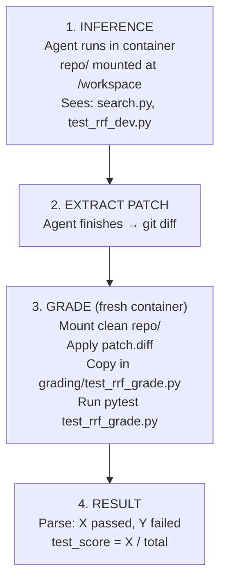
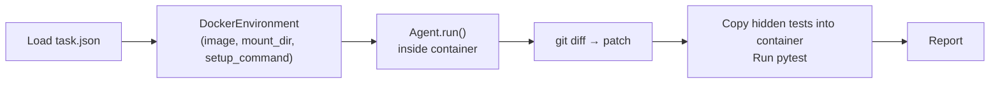

# ML Research Bench — Implementation Plan

Implement the 7 ml-research-bench tasks from [PR #15](https://github.com/Ethereal-Agents/Agent-1/pull/15) and integrate them into the existing eval harness using the existing Docker infrastructure.

## Resolved Decisions

- ✅ **Docker**: Use existing [DockerEnvironment](file:///Users/ayushdubey/Source/agent/Agent-1/tools/environment.py#L53-L95) directly with `image`, `mount_dir`, `setup_command`, `command_prefix` params.
- ✅ **Docker image**: `python:3.11` (full, not slim). Slim is missing `gcc`/`make` — any task needing C-extension packages (`numpy`, etc.) would fail. Full image is ~900MB but one-time pull.
- ✅ **arxiv_search**: Being built separately. Test with disable flow for now. Default `enable_arxiv=False`.
- ✅ **Deps per task**: Go task by task. Each task specifies its own `requirements.txt`.
- ✅ **Anti-cheating (Simplified)**: Two-tier test system, but graded in the **same container** after the agent finishes.

---

## Grading Design (Anti-Cheating)

> [!IMPORTANT]
> The agent has `read_file` access. If the test file in the repo contains `assert rrf_fuse([...]) == [doc1, doc2, doc3]`, the agent can just read it and hardcode the answer. We prevent this with a **two-tier test system** — the same pattern SWE-bench uses with `FAIL_TO_PASS` vs hidden tests.

### Two-Tier Tests

Each task has two test files:

| File | Location | Agent can see? | Purpose |
|---|---|---|---|
| `test_*_dev.py` | `repo/` (mounted) | ✅ Yes | 1–2 basic sanity tests for the agent to iterate against |
| `test_*_grade.py` | `grading/` (NOT mounted) | ❌ No | Full 5+ tests with edge cases — the real evaluation |

### Fresh Container Grading Flow

To guarantee robust evaluation and prevent any environmental side-effects from the agent (e.g., conflicting `pip install`s, modified standard libraries, or background processes), we grade the patch in a **fresh, clean container**.



**Step-by-step:**

```python
def grade_task(task_dir: str, patch: str, task_config: dict) -> MLRBGradeResult:
    """Grade a patch in a fresh container. The agent never sees these tests."""
    
    # 1. Start fresh container with clean repo (no agent modifications)
    env = DockerEnvironment(
        image=task_config["docker_image"],
        mount_dir=os.path.join(task_dir, "repo"),
        setup_command=task_config["setup_commands"],
    )
    
    # 2. Apply the agent's patch
    # Write patch to a temp file, docker cp it in, git apply
    env.write_file("/tmp/agent.patch", patch)
    env.run_bash("cd /workspace && git apply /tmp/agent.patch", timeout=30)
    
    # 3. Copy in the hidden grading tests (agent never saw these)
    grading_test = os.path.join(task_dir, "grading", f"test_{task_config['task_id']}_grade.py")
    env.write_file(f"/workspace/test_{task_config['task_id']}_grade.py", open(grading_test).read())
    
    # 4. Run grading tests
    result = env.run_bash(f"cd /workspace && pytest test_{task_config['task_id']}_grade.py -v --tb=short", timeout=120)
    
    # 5. Parse results
    passed, failed, total = parse_pytest_output(result.stdout)
    
    env.cleanup()
    return MLRBGradeResult(passed, failed, total, passed/total if total else 0.0, result.stdout)
```

**Why this is necessary:**
While the agent isn't adversarial, it is autonomous. It might run commands like `pip install` that pollute the environment, or accidentally delete files. Grading in a fresh container guarantees that the test runs against a clean, known-good environment, isolating the agent's code changes from any environmental mess it made during execution.

---

## Architecture



---

## Proposed Changes

### Component 1: Task Directories

Updated structure with the two-tier test split:

```
eval/tasks/ml_research_bench/
├── manifest.json
├── task_01_rrf/
│   ├── task.json
│   ├── repo/                          # Mounted — agent sees this
│   │   ├── search.py                  # Stub implementation
│   │   ├── test_rrf_dev.py            # 1-2 basic sanity tests
│   │   └── requirements.txt
│   └── grading/                       # NOT mounted — agent never sees
│       └── test_rrf_grade.py          # Full test suite (5+ tests)
├── task_02_ast_chunking/
│   ├── task.json
│   ├── repo/
│   │   ├── chunker.py
│   │   ├── test_chunker_dev.py
│   │   ├── sample_files/
│   │   └── requirements.txt
│   └── grading/
│       └── test_chunker_grade.py
├── task_03_self_repair/
│   ├── ...
├── task_04_hybrid_search_debug/
│   ├── ...
├── task_05_paged_attention_debug/
│   ├── ...
├── task_06_code_search/
│   ├── ...
└── task_07_agent_memory/
    ├── ...
```

**`task.json` schema:**

```json
{
  "task_id": "task_01_rrf",
  "title": "Implement Reciprocal Rank Fusion (RRF)",
  "category": "implement-from-paper",
  "difficulty": "easy",
  "description": "A hybrid search system returns two separately ranked result lists (one from dense retrieval, one from sparse). Implement the rrf_fuse() function that combines them into a single ranked list using the RRF formula.",
  "docker_image": "python:3.11",
  "setup_commands": "pip install -r requirements.txt",
  "dev_test_command": "pytest test_rrf_dev.py -v --tb=short",
  "grade_test_command": "pytest test_rrf_grade.py -v --tb=short",
  "timeout_seconds": 600,
  "expected_dev_tests": 2,
  "expected_grade_tests": 5
}
```

---

### Component 2 & 3: Runner & Grader

#### [NEW] `eval/mlrb_runner.py` & `eval/mlrb_grader.py`

Integrated directly as shown in the Simplified Grading Flow above.

---

### Component 4: Data Models

#### [MODIFY] [models.py](file:///Users/ayushdubey/Source/agent/Agent-1/eval/models.py)

```python
@dataclass
class MLRBConfig:
    tasks_dir: str = "eval/tasks/ml_research_bench"
    docker_image: str = "python:3.11"
    model: str = "gemini/gemma-4-31b-it"
    timeout_per_task: int = 600
    output_dir: str = "eval_results"
    enable_arxiv: bool = False
    max_workers: int = 1

@dataclass
class MLRBTaskResult:
    task_id: str
    category: str
    difficulty: str
    model_name: str
    model_patch: str | None
    exit_reason: str
    tests_passed: int
    tests_failed: int
    tests_total: int
    test_score: float
    pass_at_1: bool
    total_steps: int
    total_tokens: int
    total_cost: float
    duration_seconds: float
    trajectory_path: str
    pytest_output: str

@dataclass
class MLRBGradeResult:
    passed: int
    failed: int
    total: int
    test_score: float
    output_log: str
```

---

### Component 5: CLI + Prompt + Reporter

#### [NEW] [run_mlrb.py](file:///Users/ayushdubey/Source/agent/Agent-1/eval/run_mlrb.py)
#### [NEW] [mlrb_dataset.py](file:///Users/ayushdubey/Source/agent/Agent-1/eval/mlrb_dataset.py)
#### [NEW] [mlrb_reporter.py](file:///Users/ayushdubey/Source/agent/Agent-1/eval/mlrb_reporter.py)

Agent prompt format (note: only references dev tests):

```
# Task: Implement Reciprocal Rank Fusion (RRF)

## Description
A hybrid search system returns two separately ranked result lists...

## Working Directory
/workspace

## Files
- search.py — Contains the stub rrf_fuse() function you need to implement
- test_rrf_dev.py — Basic sanity tests to check your implementation

## Success Criteria
Your implementation will be evaluated against a comprehensive test suite.
Use the dev tests to verify basic correctness: pytest test_rrf_dev.py -v
```

---

## Implementation Order

**Phase 1: Task 1 (RRF) + infrastructure end-to-end**

| Step | What |
|---|---|
| 1a | Create `task_01_rrf/` — stub code, dev tests, grading tests, task.json |
| 1b | Add MLRB models to `models.py` |
| 1c | Build `mlrb_runner.py` + `mlrb_grader.py` |
| 1d | Build `mlrb_dataset.py` + `run_mlrb.py` |
| 1e | Test E2E: run agent on Task 1, verify two-tier grading works |

**Phase 2: Remaining 6 tasks** (one at a time):

| # | Task | Difficulty |
|---|---|---|
| 2 | `task_04_hybrid_search_debug` | Easy |
| 3 | `task_02_ast_chunking` | Medium |
| 4 | `task_05_paged_attention_debug` | Medium |
| 5 | `task_06_code_search` | Medium |
| 6 | `task_03_self_repair` | Hard |
| 7 | `task_07_agent_memory` | Hard |

**Phase 3: Reporter + ablation** (once arxiv_search is ready)

---

## File Summary

| File | Status | Purpose |
|---|---|---|
| `eval/tasks/ml_research_bench/manifest.json` | NEW | Task registry |
| `eval/tasks/ml_research_bench/task_01-07/` | NEW | 7 task dirs (repo/ + grading/) |
| `eval/mlrb_runner.py` | NEW | Docker setup + agent execution |
| `eval/mlrb_grader.py` | NEW | Single-container pytest grading |
| `eval/mlrb_dataset.py` | NEW | Task loading + prompt formatting |
| `eval/mlrb_reporter.py` | NEW | Results reporting |
| `eval/run_mlrb.py` | NEW | CLI entry point |
| `eval/models.py` | MODIFY | Add MLRB data models |

## Verification Plan

### For each task:
```bash
# 1. Verify stub code FAILS grading tests (baseline)
cd task_01_rrf
python -m pytest grading/test_rrf_grade.py -v  # Must be 0/5

# 2. Run agent E2E
python -m eval.run_mlrb --tasks task_01_rrf --run-id smoke-001
```

### Anti-cheat validation:
- Verify grading test file is NOT in the mounted `/workspace` directory during execution
- Verify agent trajectory shows it never accessed `test_*_grade.py`
