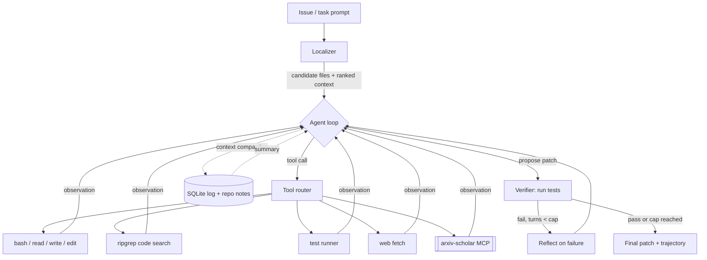

# recall-agent — Design Doc

*A coding agent that reads papers. Built on a $30 budget, no GPU, in four weeks.*

> **Status:** Draft v1 for review · **Owners:** Trinetra (agent loop, planning, eval) · Ayush (tools, MCP, orchestration, observability) · **Window:** Weeks 2–8 of the pivot plan (Jun 8 – Jul 26, 2026) · **Budget:** ~$30 API credits, no dedicated compute
>
> This doc is dual-purpose: it's the build spec we implement against, and it's meant to be pushed public as a portfolio artifact. So it states *why* for every decision, names the alternative we rejected, and is honest about the tradeoffs. Where it cites mid-2026 leaderboard numbers, treat them as directional — re-verify before quoting any figure in a blog post or interview.

---

## 1. TL;DR

recall-agent is a coding agent with one unusual capability: when it works on an ML/research repository, it can **retrieve and ground its decisions in real papers** by calling `arxiv-scholar` (our hybrid-retrieval RAG over arXiv) as a tool over MCP. Every other portfolio coding agent is a "Claude Code clone." Ours sits at the intersection of *agentic coding* and *research retrieval*, which is a story no one else in the applicant pool is telling.

The architecture is deliberately minimal, because the single most important finding in 2025–2026 coding-agent research is that **model capability dominates scaffolding**. A ~100-line bash-based agent (mini-swe-agent) is competitive with heavily-engineered harnesses. So we spend our scarce engineering budget on the two things that actually move the needle on a tight budget — **good code localization** and **execution-based verification** — plus the one thing that differentiates us — **paper-grounded retrieval** — and we skip the rest.

We measure rigor, not scale: SWE-bench Lite (tiered 10 → 50 → 300 instances) for the general coding-agent number, and a hand-authored **ml-research-bench** (15–20 tasks) for the differentiator, run as a **with-vs-without-arxiv-scholar ablation**. The ablation is the headline experiment; it's the only number that proves the thesis.

---

## 2. Goals, non-goals, success criteria

**Goals**

- Ship a working, runnable coding agent that solves real GitHub issues (SWE-bench Lite) at a credible, *honestly-reported* pass rate.
- Demonstrate a genuinely novel capability — paper-grounded code reasoning — with a clean ablation that isolates its effect.
- Produce two differentiated hiring signals from one codebase: an **infra/orchestration** story (Ayush) and an **applied-research/eval** story (Trinetra).
- Be reproducible: anyone can clone, run on the free/cheap tier, and reproduce our numbers.

**Non-goals (explicit scope cuts)**

- Not trying to top the SWE-bench leaderboard. Frontier scores require frontier models and large test-time-compute budgets we don't have. We compete on *methodology and the novel angle*, not raw score.
- No fine-tuning (expensive; the pivot plan's anti-pattern #1).
- No self-hosted model serving inside this project (that's Ayush's *separate* inference-track artifact, not recall-agent's job).
- No multi-user product, auth, or UI. CLI + logs only.
- No vector database for agent memory (justified in §6.6 — it's a 2024 reflex we're deliberately rejecting).

**Success criteria (what "done" means by Jul 26)**

| Tier | Criterion |
|---|---|
| Must-have | Agent runs end-to-end on SWE-bench Lite; reports an honest pass rate on ≥50 instances; ml-research-bench (15–20 tasks) with a clean with/without-arxiv-scholar ablation; public repo + blog post + reproducible eval harness. |
| Should-have | Full 300-instance Lite run on at least one model; failure-mode taxonomy; prompt + result caching demonstrably cutting cost; published MCP server. |
| Nice-to-have | Parallel multi-agent execution with backpressure (Ayush's infra showcase); OpenTelemetry/Langfuse traces; multi-model routing. |

**Hard constraints**

~$30 total API spend · Mac M-chip + CPU only, no GPU · two engineers, ~4 weeks part-time (this is one of three concurrent projects) · everything must degrade gracefully to the free tier for reproducibility.

---

## 3. Design principles

These fall out of the state-of-the-art review (§4) and the pivot plan's frugality ethos, and they decide every tradeoff below.

1. **Model > scaffolding.** Don't build complexity the model doesn't need. Start with the simplest loop that works and add structure only when a measured failure mode demands it. This is the central 2026 lesson.
2. **Spend the engineering budget where the evidence says it pays:** localization and execution-based verification. Spend the *novelty* budget on arxiv-scholar grounding. Skip everything else.
3. **Frugality is a feature.** Haiku/small models for 100% of dev iteration; big models only for frozen final runs. Caching is load-bearing, not optional. A $30 ceiling forces choices that read *better* in interviews than "we threw tokens at it."
4. **Honest numbers beat impressive numbers.** Report CPU-real figures, document the diagnostic when we miss a target, and never fabricate a score. Reviewers reward rigor.
5. **Measure before you scale.** Pilot every expensive run on 10 instances, extrapolate cost, *then* commit. No blind 300-instance runs.
6. **Reproducible-by-default.** If a reviewer can't rerun it on a free tier, it didn't happen.

---

## 4. State of the art (mid-2026): what we adopt, what we skip

This section is the answer to "analyze current coding-agent design patterns and pick what adds max value." The field has converged on a few hard-won lessons since the early SWE-agent era. Numbers below are directional (sources in the appendix; re-verify before quoting).

**The four findings that shape our design**

*Finding 1 — Model capability dominates scaffolding.* `mini-swe-agent` (~100 lines of Python, bash-only, no custom tool interface) reaches scores competitive with elaborate harnesses when paired with a strong model. The corollary: a hand-crafted "agent-computer interface" (ACI) is a *multiplier* on a strong model (good design might lift a capable model a few points), not a *lever* that rescues a weak one. **Implication for us:** start minimal, bash-first; don't pre-build a fancy tool interface.

*Finding 2 — Localization is the real bottleneck, not editing.* Across studies, finding the *right file and lines* to change is where agents lose the most ground, especially on larger repos. Hybrid retrieval (keyword/BM25 + a light semantic rerank) is the budget sweet spot; pure dense retrieval is overkill for the repo sizes in SWE-bench Lite. **Implication:** invest here — and conveniently, this is exactly the retrieval expertise we already built in arxiv-scholar.

*Finding 3 — Test-time iteration has a low ceiling.* The biggest gain comes from the **first** test-driven refinement turn; the second is moderate; beyond ~3–7 turns you hit context pollution and diminishing returns. Execution-based verification (run the tests, feed back structured pass/fail, retry) is the single highest-ROI reliability technique. **Implication:** cap the loop, make test feedback first-class, and don't build open-ended deliberation.

*Finding 4 — Start simple on control flow.* Anthropic's "Building Effective Agents" and the broader 2026 consensus: prefer the simplest pattern that works (prompt chaining → routing → orchestrator-workers → full agent), and reach for planner/critic separation only when task complexity justifies the token and latency cost. Reflexion-style self-critique reinforces a model's own blind spots if used by default; add it *only after* a failed attempt. **Implication:** a single ReAct-style loop with a *bounded* reflection-on-failure step, not a standing planner/executor/critic triad.

**Adopt vs. skip**

| Adopt (high ROI on our budget) | Skip (complexity the evidence doesn't justify yet) |
|---|---|
| Minimal, bash-first agent loop | Hand-crafted stateful shell / elaborate ACI |
| Hybrid localization (ripgrep/BM25 + light embeddings) | Pure dense retrieval over the repo |
| Execution-based verification, **1–2** refinement turns | Open-ended/unbounded iteration loops |
| Bounded reflection *only on failure* | Standing planner→executor→critic triad by default |
| Prompt caching + result caching (budget-critical) | Vector DB for agent memory |
| Native tool-calling for structured output | Constrained-decoding libs (Outlines/Instructor) at v1 |
| SQLite trajectory log + repo-notes file | Knowledge-graph memory |
| arxiv-scholar over **MCP** (reusable, isolated, on-narrative) | Custom multi-protocol interface layer |
| Multi-model routing *(cheap default → expensive fallback)* | Self-hosting a model inside this project |
| Lightweight tracing (JSONL; Langfuse free tier optional) | Bespoke OpenTelemetry pipeline |

The through-line: **every "skip" is something we can add later if a measured failure demands it.** Shipping the minimal version first is itself the defensible engineering decision.

---

## 5. Architecture overview



The control flow is a **single ReAct-style loop** preceded by a cheap **localization pre-step** and followed by an **execution-based verifier** with a **bounded reflection** edge. The loop reasons, calls a tool, observes, and repeats; when it proposes a patch, the verifier runs the tests; on failure (and only while under the turn cap) it reflects once and retries. Memory is a SQLite trajectory log plus a lightweight repo-notes file; when context approaches the window limit it's compacted by anchored summarization (keep the issue + first observations + last few turns, summarize the middle).

This is intentionally close to the minimal end of the spectrum. We're betting (per Finding 1) that the model carries most of the weight, and we're spending our complexity budget on localization, verification, and the arxiv-scholar tool rather than on an elaborate orchestrator.

---

## 6. Component design

Each component lists the **decision**, the **rationale**, the **alternatives** we considered, the **tradeoff** we're accepting, and **further improvements** if budget/time/credits expand.

### 6.1 Control flow: single loop + bounded reflection

**Decision.** One ReAct-style loop (reason → tool-call → observe). A localization pre-step seeds it. A verifier runs tests on the proposed patch; on failure, a single reflection turn analyzes the test output and the loop retries. Hard cap at ~30–50 steps and **2 refinement turns**.

**Rationale.** Findings 1, 3, 4. The first refinement turn delivers most of the test-time gains; standing planner/critic roles add token cost and latency that the evidence says we don't need at this scale. Keeping it one loop also keeps the trajectory legible — which matters because the *trajectories are part of the deliverable* (we publish failure analyses).

**Alternatives.**
- *Plan-and-Execute (planner on a strong model, executor on a cheap one).* Genuinely cheaper for long multi-step tasks and a real pattern in 2026. We reject it at v1 because SWE-bench tasks are mostly localize-then-edit, not long open-ended plans; the planner overhead doesn't pay off yet. It's our first upgrade if tasks get longer (see ml-research-bench multi-step tasks).
- *AgentLess-style fixed pipeline (localize → repair → validate, no loop).* Cheapest and very predictable (~⅒ the tokens). We borrow its *localization-first* idea but keep a light loop for flexibility; the 2026 consensus is these are complementary, and pure-pipeline is brittle on tasks needing iteration.
- *Full planner→executor→critic triad.* Rejected as premature complexity; revisit only if failure analysis shows planning errors dominate.

**Tradeoff.** A single loop can wander on genuinely complex tasks where an explicit plan would help. We accept this and let the step cap + verification bound the damage, and we'll *measure* whether planning errors are a top failure mode before adding a planner.

**Further improvements.** Add an explicit planner for multi-step ml-research-bench tasks; add execution-based best-of-N selection if credits land (sample K patches, rerank by tests).

### 6.2 Model strategy & routing

**Decision.** **Haiku-class (cheap) model for 100% of development and iteration.** A **Sonnet-class** model only for frozen final/headline runs. An OpenRouter key as a fallback/secondary provider. Optionally, simple **routing**: cheap model by default, escalate to the stronger model only on instances the cheap one fails.

**Rationale.** The $30 ceiling makes this non-negotiable; it's also good engineering (Finding 1 says the cheap model gets you most of the way during dev). Routing — escalate-on-failure — is an emerging 2026 cost pattern that can cut average spend substantially without much code.

**Alternatives.**
- *Single premium model throughout.* Simplest, but blows the budget in days. Rejected.
- *Open-weight coding models (Qwen/DeepSeek-class) via a cheap API.* Strong cost-to-performance and a nice "frugality" story; viable as the cheap tier if Haiku pricing is unfavorable. We keep this as a documented option and may benchmark one for the blog.
- *Self-hosted small model.* No GPU; rejected for this project.

**Tradeoff.** Multiple providers/models add config and make results less directly comparable across runs. Mitigation: pin model+version in every result file; always report which model produced which number.

**Further improvements.** If credits land: run the headline on a frontier model; add ensemble voting on hard instances.

### 6.3 Tools

**Decision.** A small, sharp tool set: `bash` (the universal substrate), `read_file`, `write_file`, `edit` (string-replace with a unique-match guard), `code_search` (ripgrep), `run_tests`, `web_fetch`, and the **arxiv-scholar** retrieval tool (over MCP, §6.5). Target ~7–9 tools.

**Rationale.** 2026 tool-design guidance: ~5–15 tools is the sweet spot; beyond ~20, tool-selection accuracy drops. Error messages must be **LLM-readable** (typed error + the offending input + a corrective hint), because vague errors send agents into retry loops — a documented top failure cause. `bash` alone covers a surprising amount (mini-swe-agent's whole thesis); the explicit file/search/test tools exist because they give cleaner, more cacheable observations than parsing raw bash stdout.

**Alternatives.**
- *Bash-only (mini-swe-agent style).* Tempting for minimalism. We keep a few structured tools because clean, schema'd observations make trajectories easier to analyze and cache, and make `run_tests` feedback reliable — which is our highest-ROI signal.
- *Rich SWE-agent-style ACI (windowed viewer, linting on edit, etc.).* Finding 1 says the payoff is marginal on a strong model. Skip at v1; the `edit` unique-match guard captures most of the benefit (it prevents the classic "edit applied to the wrong location" failure) at a fraction of the cost.

**Tradeoff.** A small tool set occasionally forces the model to compose bash where a bespoke tool would be cleaner. Acceptable, and reversible.

**Further improvements.** Add a windowed file viewer and on-edit linting feedback if edit-localization errors show up in the failure taxonomy.

### 6.4 Localization / code retrieval

**Decision.** Hybrid: ripgrep/keyword search seeded by issue terms + symbols, optionally reranked by a light embedding pass (reuse arxiv-scholar's embedding/rerank stack on the candidate files). Produce a ranked shortlist of files/lines that seeds the loop.

**Rationale.** Finding 2 — localization is the bottleneck and hybrid is the budget sweet spot for SWE-bench-Lite-sized repos. We already own a strong hybrid-retrieval implementation (arxiv-scholar); pointing it at code is high-leverage reuse and a *natural narrative bridge* between our two projects.

**Alternatives.**
- *BM25/keyword only.* Cheapest; often enough on small repos. We start here and add the embedding rerank only if recall on the right file is the measured bottleneck.
- *Pure dense/semantic retrieval.* Overkill for these repo sizes and adds embedding cost; rejected at v1.
- *Let the agent search interactively with ripgrep (no pre-step).* Works, but burns turns/tokens on every run. A cheap pre-step front-loads the win.

**Tradeoff.** A separate localizer is one more moving part and can mislead the agent if it surfaces the wrong files. Mitigation: the localizer's output is *advisory* (ranked candidates), and the agent can still search freely.

**Further improvements.** Structural/graph signals (import graph, call graph); a small RL-trained search policy if this becomes the focus.

### 6.5 arxiv-scholar grounding (the differentiator) — over MCP

**Decision.** Expose arxiv-scholar as an **MCP server** with a `search_papers(query, k)` tool (and optionally `get_paper_context(id)`). recall-agent calls it when it detects a research/ML context — e.g., the task references a paper, an algorithm name, or a technique it should implement faithfully. Grounding flows into the agent's reasoning as retrieved abstracts/snippets with citations.

**Rationale.** This is the project's entire reason to exist, and MCP is the right boundary: it's reusable (the same server is itself a publishable artifact and demoable in arxiv-scholar's launch), it isolates the retrieval logic in its own process, and — critically for the pivot — **MCP has become mainstream agent infrastructure** (broad adoption across major vendors, and reportedly moving toward vendor-neutral governance under a Linux Foundation body in late 2025 — verify the governance detail before citing it), so building a clean MCP server is itself a current, on-narrative signal. It also cleanly maps to Ayush's "tool orchestration / MCP server" ownership.

**When it's invoked (the design subtlety).** Indiscriminate retrieval hurts: it pollutes context and burns tokens. So grounding is *gated* — triggered by a lightweight router check (task mentions a paper/method, or the agent explicitly requests grounding), not on every step. This gating is exactly what the ablation measures.

**Alternatives.**
- *In-process function tool (no MCP).* Lower latency, trivial setup, easier debugging. We reject it *for this tool specifically* because reusability + the MCP-as-signal value + clean isolation outweigh the overhead — and the latency cost is negligible relative to LLM calls. (Note: for the tight inner tools like `edit`, in-process is correct — MCP isn't dogma here.)
- *Stuff papers into the system prompt.* Doesn't scale, no retrieval, defeats the point.

**Tradeoff.** MCP adds a process boundary and JSON-RPC overhead, and one more thing to keep running during evals. Accepted for the reasons above; we document the in-process alternative honestly.

**Further improvements.** Cross-encoder rerank on retrieved papers; a `cite_paper` action that the agent must use to justify research-grounded decisions (makes the grounding *auditable* — great for the eval write-up); caching retrieval results per task.

### 6.6 Memory & context management

**Decision.** SQLite trajectory log (durable, queryable: every step, tool call, observation, token count, cost) + a small **repo-notes** scratchpad (Claude-Code-`CLAUDE.md`-style learnings). Context compaction by **anchored summarization**: keep the issue statement + first observations + last few turns verbatim, summarize the middle, when nearing the window limit. **No vector DB.**

**Rationale.** The 2024 reflex was "agent memory = vector DB." The 2026 consensus pulled back: pure vector memory is weak at multi-hop reasoning and compacts poorly; for *coding* agents, each SWE-bench instance is independent, so cross-instance memory adds context cost with little benefit. A durable episodic log + structured summarization is simpler and nearly as effective, and anchored summarization specifically avoids the "context collapse" that naive iterative summarization causes. The SQLite log doubles as our **eval data source** — trajectories, costs, and failure analysis all come from it.

**Alternatives.**
- *Vector DB (Mem0/Chroma/etc.) for memory.* Rejected per above; the plan itself says "avoid vector DB hype." (Note: this is about *agent memory* — arxiv-scholar's retrieval is a separate, justified use of embeddings.)
- *Naive rolling summarization.* Causes detail loss; anchored summarization is the targeted fix.
- *Raw truncation.* Cheapest but drops the issue statement / early context that matters most.

**Tradeoff.** Anchored summarization can still drop a mid-trajectory detail that later turns out to matter. Mitigation: the SQLite log retains everything, so the agent can re-query specifics, and we can tune what's anchored based on failure analysis.

**Further improvements.** Learned compaction (let the model decide when/what to compact — the "sawtooth" pattern); per-file selective pruning by recency for very long runs.

### 6.7 Structured output

**Decision.** Use the provider's **native tool-calling / typed-parameter API** for all structured output (tool calls, the final patch envelope). Add a thin Pydantic validation layer at the boundary only if we see malformed outputs.

**Rationale.** In 2026, native tool-calling is reliable enough that constrained-decoding libraries are optional for hosted models. Less code, fewer dependencies, one less thing to debug.

**Alternatives.** *Instructor* (Pydantic + cross-provider) is worth it if we need portability across many providers; *Outlines* (constrained decoding) is the right call for *local* models where you must guarantee valid JSON. Neither is needed at v1 on hosted APIs. We'll reach for Instructor if multi-provider validation becomes painful.

**Tradeoff.** Leaning on native APIs ties us slightly to provider behavior. Low risk; mitigated by the validation layer.

### 6.8 Verification

**Decision.** Execution-based: run the repo's tests (and the issue's reproduction, when present) on every proposed patch. Feed back a **structured** pass/fail summary (not raw stderr). On failure, one reflection turn that must read the test output before retrying. Cap at 2 refinement turns.

**Rationale.** Finding 3 — this is the highest-ROI reliability technique, and structured execution summaries beat dumping verbose logs into context (a documented improvement). "Read the test output before retrying" is a concrete, cheap fix for a common failure (blind retries).

**Alternatives.**
- *LLM self-critique without execution.* Weaker and prone to confirming its own errors (the Reflexion blind-spot problem). Execution is ground truth; prefer it.
- *Best-of-N with execution reranking.* Real gains (sample K patches, pick the one that passes the most tests) but K× the cost. Out of budget at v1; first thing to add if credits land.

**Tradeoff.** Running tests is slow on CPU and some repos are heavy to set up; this dominates wall-clock time. Accepted — correctness signal is worth it — and mitigated by the Docker sandbox (§6.10) and aggressive result caching.

**Further improvements.** Best-of-N + execution rerank; regression-test awareness (don't break passing tests); generate a reproduction test first when the issue lacks one.

### 6.9 Cost control: prompt caching + result caching

**Decision.** (1) **Anthropic prompt caching** on every long-context call — the system prompt, tool schemas, and stable repo context are cached so repeated calls pay ~10% of input cost on cache reads. (2) **Result caching** — hash (prompt + model + params) → store the response; reuse during dev and re-runs so we never pay twice for the same call.

**Rationale.** This is the difference between $30 lasting the project and lasting three days. Prompt caching realistically cuts input cost on context-heavy agents by ~50–90%; for an agent that re-sends the same system prompt + repo context across dozens of calls, it's the highest-leverage line of code in the repo. Result caching makes dev iteration and re-runs effectively free for unchanged calls. The pivot plan flags both as mandatory — this section is where we honor that.

**Alternatives.** *Semantic caching* (fuzzy-match similar prompts) — premature; exact-hash caching first, measure, add semantic only if there's a real hit-rate opportunity. *No caching* — not survivable on $30.

**Tradeoff.** Caching adds invalidation logic and the risk of serving a stale response during active development. Mitigation: cache keyed on full prompt+model+params; a `--no-cache` flag for final frozen runs.

### 6.10 Execution sandbox

**Decision.** Run agent-generated code and tests in **Docker** containers (per-instance, disposable). Use the SWE-bench harness's existing container images where available.

**Rationale.** Agent code is untrusted by definition; containers are the standard isolation boundary and SWE-bench already ships per-instance environments. This also makes runs reproducible.

**Alternatives.** *e2b / hosted sandboxes* — nice DX but adds cost/dependency; local Docker is free and sufficient on a Mac. *No sandbox* — unacceptable (running arbitrary generated code on the host).

**Tradeoff.** Docker image pulls/builds are slow and disk-heavy on a laptop; first run is painful. Accepted; cache images locally.

### 6.11 Observability

**Decision.** v1: structured **JSONL trajectory + cost logs** straight out of the SQLite layer, plus a tiny script that renders a run summary (pass rate, cost, tokens, failure tags). Optional upgrade: **Langfuse free tier** (or self-hosted) for trace visualization, which Ayush owns as part of the infra narrative.

**Rationale.** A solo/2-person project doesn't need an enterprise observability stack; JSONL + a summary script gives us everything for the eval write-up at zero cost. Langfuse is the lightweight 2026 standard if we want pretty traces and a cost dashboard for the launch/demo — and it slots into Ayush's "observability-cost reduction" Percy story.

**Alternatives.** *Bespoke OpenTelemetry pipeline* — overkill; *LangSmith* — best only if we were on LangGraph (we're not).

**Tradeoff.** Rolling our own logging means we build a bit of plumbing Langfuse would give free. Minor; the SQLite log is needed for eval anyway.

---

## 7. Evaluation strategy

This is where Trinetra's applied-research narrative lives, and it's what separates "a coding agent" from "a measured study." Two benchmarks, one ablation.

**7.1 SWE-bench Lite (the general coding number).** Tiered to protect the budget: **10 instances** for fast iteration (run constantly), **50** for mid-scale checkpoints, **300 (full Lite)** only for frozen final runs. Always pilot cost on the 10-set and extrapolate before a big run. Report pass@1, cost/instance, and tokens/instance, with the model+version pinned. We benchmark against published baselines for context, not to win.

**7.2 ml-research-bench (the differentiator — we author it).** 15–20 tasks across three types: *implement-from-paper* (e.g., "implement this attention variant from the described block diagram"), *debug-with-paper-context* (a bug whose fix depends on understanding a paper's method), and *retrieve-the-right-paper* (the agent must find the correct reference to proceed). This is the asset almost no one else has; it's worth authoring carefully and documenting the rubric.

**7.3 The headline experiment — with vs. without arxiv-scholar.** Run ml-research-bench (and a research-flavored slice of Lite) **with arxiv-scholar grounding enabled vs. disabled**, same model, same seeds. The delta is the entire thesis of the project. If grounding helps, that's the blog post and the interview story. If it *doesn't* help on some task types, that's an honest, interesting finding too (and tells us where gating should trigger). Either outcome is publishable; a null result reported well still demonstrates research taste.

**7.4 Failure-mode taxonomy.** Every losing trajectory gets tagged: localization error / planning error / tool error / hallucination / test-misread / environment failure. The taxonomy drives what we add next (e.g., if planning errors dominate → add a planner per §6.1) and is itself a strong write-up artifact. It also feeds directly into Project 3 (agent-probe).

**Metrics we report:** pass@1, cost/instance, tokens/instance, mean turns-to-solve, refinement-turn lift (does turn 2 actually help?), and the grounding ablation delta. All reproducible from the SQLite logs.

---

## 8. Budget plan (~$30)

The pivot plan sketches a final Sonnet run at $50–100; **with a $30 ceiling that run is not affordable as described**, so this is the reconciliation. The honest plan: do *all* development and iteration on the cheap tier with caching, and reserve the budget for a small number of frozen, measured runs.

**Frugal tactics (all mandatory):** prompt caching on every long-context call; exact-hash result caching; Haiku/cheap model for 100% of dev; pilot-then-extrapolate before any run >10 instances; small models for the ablation dev, big model only for the one frozen headline.

**Illustrative ledger (estimates — calibrate on a real 10-instance pilot first):**

| Line item | Model | Scale | Est. cost |
|---|---|---|---|
| All dev iteration (constant 10-instance loops) | Haiku/cheap | many runs, cached | $3–6 |
| Mid checkpoints | Haiku/cheap | 50 instances ×2 | $3–5 |
| Full Lite headline (frugal) | Haiku/cheap, cached | 300 instances | $5–10 |
| Sonnet partial headline | Sonnet, cached | 50–100 instances | $6–10 |
| ml-research-bench + ablation | mixed, cached | 15–20 tasks ×2 conditions | $3–5 |
| Buffer | — | — | ~$3 |

Summed, that's roughly **$23 (disciplined) to $39 (loose)** — and the loose end overshoots $30. That gap *is* the point: the budget only holds if the discipline holds. The three things that keep it under $30 are (a) caching actually landing its 50–90% input savings, (b) the headline being Haiku-full + Sonnet-*partial* rather than Sonnet-full, and (c) the pilot gate killing any run whose extrapolated cost is too high before it runs. If the Week-1 pilot shows per-instance cost at the high end, we cut the Sonnet-partial scope (50 instances, not 100) and the mid checkpoints first.

**The key reconciliation:** $30 buys a *full Haiku Lite run* + a *partial Sonnet run* + the ablation — **not** a full 300-instance Sonnet run. That's fine: a rigorous Haiku-full + Sonnet-partial result with a clean ablation beats a sloppy Sonnet-full number, and it's the exact "rigor over scale" narrative the pivot plan wants. **If credits land** (decision cutoff Jun 14): upgrade the headline to a full Sonnet/frontier run, add best-of-N verification, and broaden the ablation — but keep dev on the cheap tier regardless.

These are estimates; the **first deliverable of Week 1 of the build is a measured cost-per-instance on 10 Haiku instances**, which replaces this table with real numbers.

---

## 9. Four-week build plan

Mapped to pivot-plan Weeks 2–8, with the owner split (Trinetra → loop/planning/eval; Ayush → tools/MCP/orchestration/observability). Each week has an exit criterion; the 80%-and-ship rule applies.

**Week 1 of build (Pivot Wk 2, Jun 8–14) — scaffold + first end-to-end.** Repo, this design doc public (collect feedback from 5 people). Minimal loop: reason→tool→observe with `bash`, `read_file`, `write_file`. Docker sandbox, ripgrep `code_search`, `web_fetch`. Solve one SWE-bench Lite instance end-to-end (human first, then agent), capture the trajectory. **Measure cost/instance on Haiku (10 instances).** Commit the compute A/B path in writing by Jun 14.
*Exit:* public repo, ≥4 tools, runnable end-to-end on a toy task, design doc public, measured cost number, 1 OSS PR.

**Week 2 of build (Pivot Wk 3, Jun 15–21) — eval harness + arxiv-scholar MCP + first numbers.** Wire SWE-bench Lite harness + trajectory logging (SQLite). Stand up the arxiv-scholar MCP server and connect it; first grounded run on a toy ML task. First 10-instance Haiku mini-eval; capture pass rate, cost, trajectories. Begin failure-mode tagging. Add prompt + result caching. Localizer v1 (ripgrep/BM25).
*Exit:* ≥5/10 Lite mini-eval on Haiku; arxiv-scholar reachable as a tool; failure taxonomy started; caching live.

**Week 3 of build (Pivot Wk 4, Jun 22–28) — iterate to a real number + scale the eval.** Iterate planner/loop prompt; add the bounded reflection-on-failure + structured test feedback. Expand to 50 instances. First mid-scale Haiku run (budget cap $5). Begin authoring ml-research-bench (5–7 tasks). Failure-mode deep dive; add error-recovery patterns.
*Exit:* ≥10/50 Lite on Haiku (~20%, in line with early published baselines); ml-research-bench scaffolded; refinement-turn lift measured.

**Week 4 of build (Pivot Wk 5, Jun 29–Jul 5) — full runs + the ablation.** Full 300-instance Haiku run (cap ~$10). Sonnet partial run (50–100, cached). Expand ml-research-bench to 15–20 tasks and run the **with/without-arxiv-scholar ablation** — the headline experiment. Side-by-side analysis; freeze numbers.
*Exit:* headline pass rate (Haiku-full + Sonnet-partial); ablation delta computed; cost dashboard. This is the result the blog is built on.

**Weeks 5–7 (Pivot Wks 6–8, Jul 6–26) — polish, observability, parallel exec, launch.** Ayush: observability (Langfuse/OTel), parallel multi-agent execution with backpressure (the infra showcase), README + architecture doc, demo. Trinetra: write-up, ablation analysis, ml-research-bench rubric doc, Fellows-application tie-in. Tag v1.0; launch on HN/X with the blog "recall-agent: a coding agent that reads papers."

---

## 10. Risks & mitigations

| Risk | Likelihood | Mitigation |
|---|---|---|
| arxiv-scholar grounding shows no measurable lift | Medium | Report it honestly — a well-run null result still demonstrates rigor; use it to tune gating; the *methodology* is the signal. |
| $30 runs out before the headline run | Medium | Pilot-then-extrapolate; caching mandatory; Haiku-full + Sonnet-partial instead of Sonnet-full; hard per-run caps. |
| SWE-bench environment setup eats the week | High | Use the official harness/images; timebox; start with the 10-set; lean on the community's existing container images. |
| Scope creep (planner, best-of-N, vector memory) | High | The "skip" list in §4 is a contract; add complexity only when a tagged failure mode demands it. |
| Single-loop wanders on hard tasks | Medium | Step cap + execution verification bound it; measure planning errors before adding a planner. |
| Two-person merge/coordination friction | Low | Clean ownership boundary (loop/eval vs tools/infra) + the MCP process boundary makes the seam explicit. |
| Mid-2026 model/price assumptions wrong | Medium | Pin model+version per result; cost ledger is illustrative until the Week-1 measurement replaces it. |

---

## 11. Stack & repo layout

**Stack:** Python 3.11+ (uv), Anthropic SDK (+ OpenRouter fallback), SQLite, Docker, ripgrep, MCP Python SDK, pytest. Optional: Langfuse.

```
recall-agent/
  agent/            # loop, localizer, verifier, compaction
  tools/            # bash, file ops, code_search, run_tests, web_fetch
  mcp/              # arxiv-scholar MCP server + client wiring
  eval/             # swe-bench-lite harness, ml-research-bench, scoring, failure-tagging
  memory/           # sqlite log, repo-notes, caching
  prompts/
  runs/             # frozen result artifacts (json) — committed for reproducibility
  README.md
  DESIGN.md         # this doc
```

---

## 12. Open decisions (resolve in build Week 1)

1. **Cheap-tier model:** Haiku vs. an open-weight coding model via a cheap API — decide on the Week-1 cost/quality pilot.
2. **Localizer depth at v1:** ripgrep-only vs. ripgrep + embedding rerank — start ripgrep-only, add rerank only if file-recall is the measured bottleneck.
3. **arxiv-scholar trigger policy:** explicit agent request only, vs. an automatic router heuristic — start explicit (simpler, cleaner ablation), add heuristic later.
4. **ml-research-bench task mix:** how many of each type, and the scoring rubric (exact-match vs. test-based vs. rubric-graded) — design with the eval in mind so grading is reproducible.

---

## Appendix — sources

Durable architectural lessons are well-corroborated; specific mid-2026 leaderboard/price figures are directional and should be re-verified before public quoting.

*Architecture, minimalism, ACI, localization:* SWE-agent (Yang 2024, ACI); mini-swe-agent (project + HN discussion); "Inside the Scaffold" taxonomy (arXiv 2604.03515); AgentLess (Xia 2024) and Kimi-Dev "Agentless training as skill prior" (arXiv 2509.23045); Cursor semantic-search writeup; "Reformulate, Retrieve, Localize" (arXiv 2512.07022).

*Test-time scaling & verification:* Salesforce TEX (execution-based cross-validation); CMU "agent test-time scaling has a ceiling" (2026); JetBrains observation-masking/summarization study (2025).

*Control flow & memory:* Anthropic "Building Effective Agents"; "ReAct, Plan-and-Execute, or Reflection" (2026); Reason-Plan-ReAct (arXiv 2512.03560); "Memory for Autonomous LLM Agents" (arXiv 2603.07670); Claude Code subagents docs.

*Tools & MCP:* MCP 2026 roadmap + adoption statistics (Linux Foundation / Agentic AI Foundation); "2026 Guide to the MCP Ecosystem"; tool-design + LLM-readable-error guidance (Zylos, 2026).

*Structured output:* "Structured Outputs in 2026"; Instructor / Outlines comparisons.

*Prompt caching:* Anthropic prompt-caching docs; cost case studies (50–90% input savings).

*Observability:* Langfuse / OpenTelemetry GenAI conventions; "Top 6 Agent Observability Platforms (2026)."

(Full URLs collected during research are available on request; the foundational papers are also listed in PIVOT_PLAN's master resource list.)
